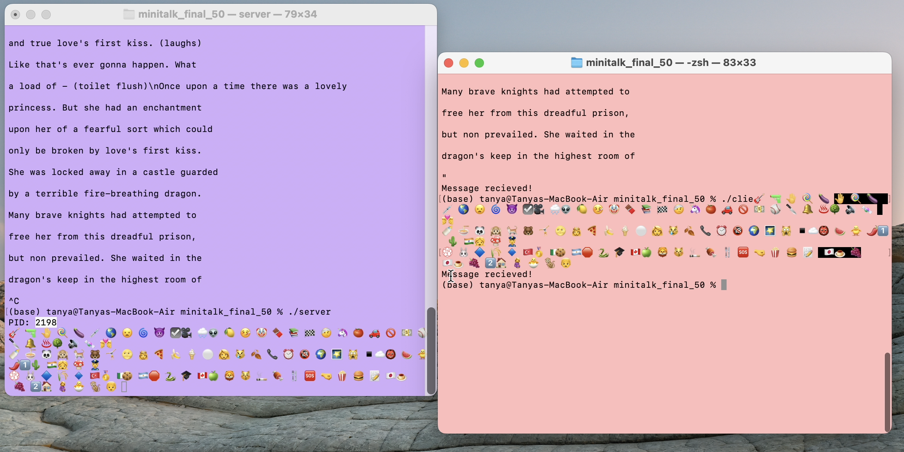

# MINITALK

#### Description:

Minitalk is a small communication program in the form of a client and a server written completely on C language. The server is started first, and after its launch it prints its PID (process ID, a number used by most operating system kernels—such as those of Unix, macOS and Windows—to uniquely identify an active process). The client takes two parameters as the command line arguments: server PID and string to send. The client sends the string passed as the parameter to the server. Once the string has been received, the server prints it.

For this program I recreated printf function from scratch and also used Makefile for the more convenient compilation of multiple files. The communication between client and server are done only using UNIX signals: SIGUSR1 and SIGUSR2. Signals are standardized messages sent to a running program to trigger specific behavior, such as quitting or error handling. They are a limited form of inter-process communication (IPC), typically used in Unix, Unix-like, and other POSIX-compliant operating systems.

Characters are send to the server bit by bit. The server acknowledges every message received by sending back a signal to the client. Unicode characters are also supported.

Minitalk except ft_printf, includes two .c files: client.c, server.c, minitalk.h is a header that keeps functions' prototypes and Makefile is used for the more convenient compilation. Minitalk is also part of my other 42 projects (coding school). To compile a program, just use 'make' command in the terminal, and then execute './server' and './client' programs in separate terminal windows.

In this project the following functions are used:
<ol>
<li>write</li>
<li>own recreated printf</li>
<li>signal</li>
<li>own reacreated atoi</li>
<li>exit</li>
<li>usleep</li>
<li>kill</li>
<li>sigaction</li>
<li>sigemptyset</li>
</ol>

Function <i><b>write()</b></i> returns the number of bytes successfully written into the file, which may at times be less than the specified nbytes. It returns -1 if an exceptional condition is encountered, see section on errors below.

Function <i><b>signal()</b></i> sets a function to handle signal i.e. a signal handler with signal number sig.

Function <i><b>kill()</b></i> sends a signal to a process or process group specified by pid.

Function <i><b>sigaction()</b></i> examines, changes, or both examines and changes the action associated with a specific signal.

Function <i><b>sigemptyset()</b></i> part of a family of functions that manipulate signal sets.

In this program I also used <i><b>struct sigaction</b></i>, which specifies how to handle a signal.

